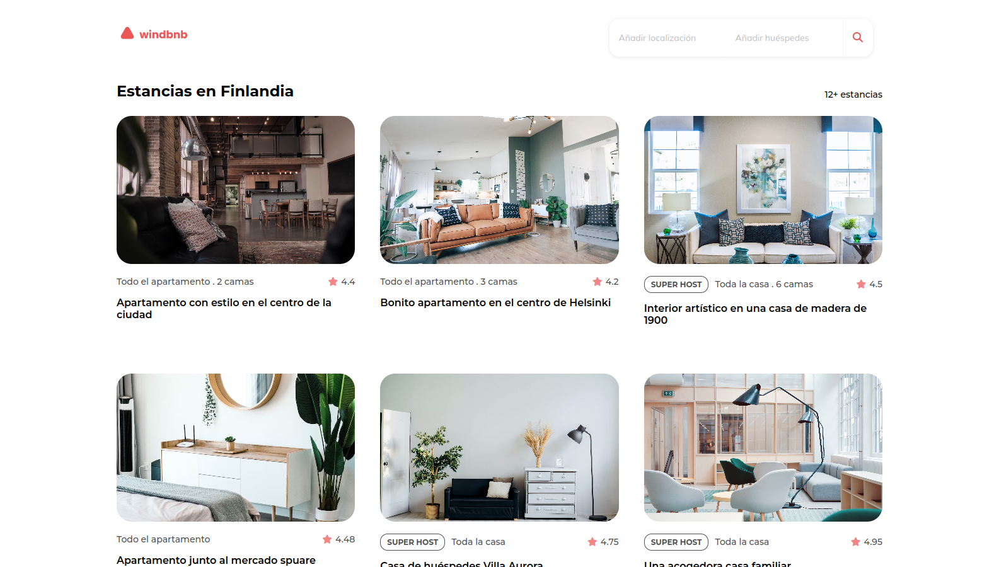
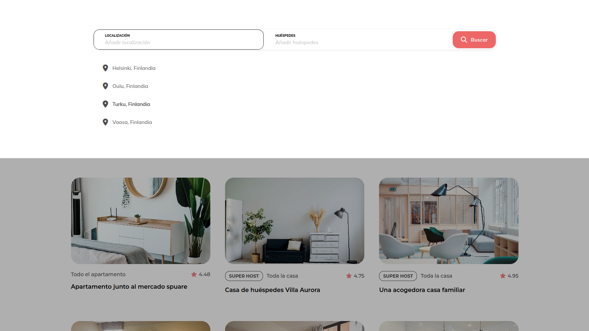
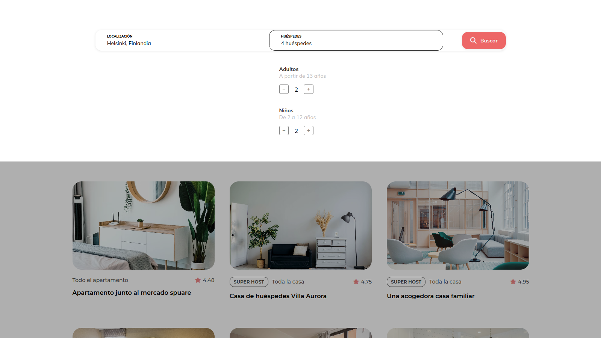
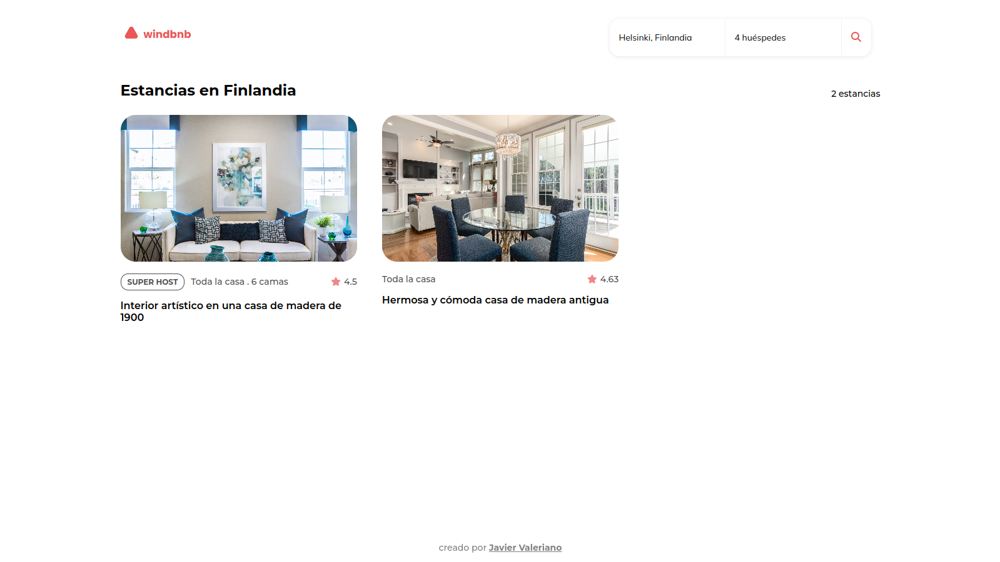
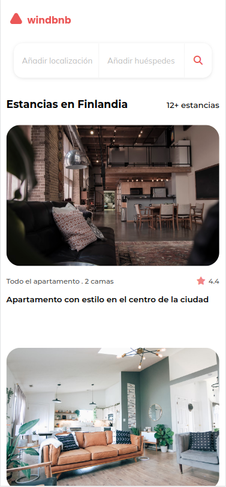
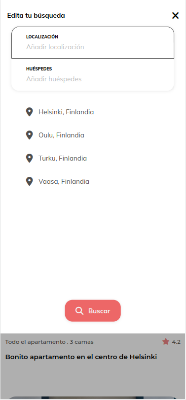
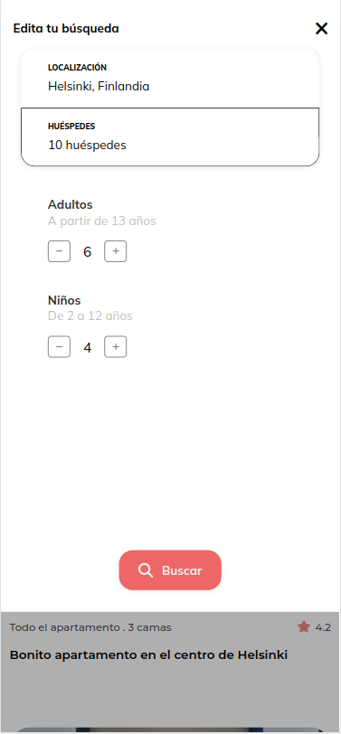
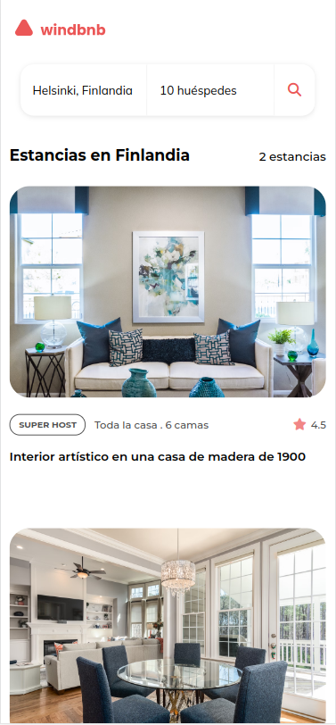

<!-- Please update value in the {}  -->

<h1 align="center">windbnb</h1>

<div align="center">
   Solución para un desafío de <a href="http://devchallenges.io" target="_blank">Devchallenges.io</a>. | Solution for a challenge from  <a href="http://devchallenges.io" target="_blank">Devchallenges.io</a>.
</div>

<div align="center">
  <h3>
    <a href="https://javiervaleriano.github.io/windbnb">
      Demo
    </a>
    <span> | </span>
    <a href="https://devchallenges.io/solutions/BycrB0DP37HbCqBecoAO">
      Solución / Solution
    </a>
    <span> | </span>
    <a href="https://devchallenges.io/challenges/3JFYedSOZqAxYuOCNmYD">
      Desafío / Challenge
    </a>
  </h3>
</div>

<!-- TABLE OF CONTENTS -->

## Table of Contents

- [Visión general | Overview](#visi%C3%B3n-general--overview)
  - [Construido con | Built With](#construido-con--built-with)
- [Características | Features](#caracter%C3%ADsticas--features)
- [Cómo usar | How to use](#c%C3%B3mo-usar--how-to-use)
- [Agradecimientos | Acknowledgements](#agradecimientos--acknowledgements)
- [Contacto | Contact](#contacto--contact)

<!-- OVERVIEW -->

## Visión general | Overview

### Escritorio | Desktop






### Móvil | Mobile






**lang="es"**: Hola, persona que está viendo mi proyecto :) Este desarrollo fue muy bueno y me gustó mucho porque este es mi primer proyecto en el que utilicé oficialmente TypeScript. He mejorado mi entendimiento en este superset de JavaScript que es nuevo para mí y el desarrollo de este desafío me ayudó a generar una UI un poco más profesional en comparación a los anteriores que he hecho hasta el momento.

Realmente estos proyectos son la oportunidad perfecta para fortalecer y poner en práctica aquello nuevo que se ha aprendido o se quiere reforzar.

**lang="en"**: Hello, person who is watching my project :) This development was very good and I really liked it because this is my first project where I officially used TypeScript. I have improved my understanding in this superset of JavaScript which is new to me and the development of this challenge helped me to generate a bit more professional UI compared to the previous ones I have done so far.

### Construido con | Built With

<!-- This section should list any major frameworks that you built your project using. Here are a few examples.-->

- [React](https://reactjs.org/)

## Características | Features

<!-- List the features of your application or follow the template. Don't share the figma file here :) -->

**lang="es"**: Esta aplicación/sitio fue creada como una presentación a un desafío de [DevChallenges](https://devchallenges.io/challenges). El [reto](https://devchallenges.io/challenges/3JFYedSOZqAxYuOCNmYD) consistía en construir una aplicación para completar las historias de usuario dadas:

**lang="en"**: This application/site was created as a submission to a [DevChallenges](https://devchallenges.io/challenges) challenge. The [challenge](https://devchallenges.io/challenges/3JFYedSOZqAxYuOCNmYD) was to build an application to complete the given user stories:

- User story: Puedo ver una lista de propiedades | I can see a list of properties
- User story: Puedo ver la ficha de la propiedad con el nombre, la calificación, el tipo de apartamento y el superanfitrión | I can see the property card with a name, rating, apartment type, and super host
- User story: Puedo abrir el cajón del filtro | I can open the filter drawer
- User story: Puedo filtrar propiedades por ubicación y cantidad de huéspedes | I can filter properties by location and number of guests
- User story: Puedo ver el número de elementos filtrados | I can see the number of filtered items
- User story: Puedo ver las páginas acorde a los diseños dados | I can see pages following given designs.

## Cómo usar | How To Use

<!-- Example: -->

**lang="es"**: Para clonar y ejecutar esta aplicación, necesitarás [Git](https://git-scm.com) y [Node.js](https://nodejs.org/es/download/) (que viene con [npm](http://npmjs.com)) instalados en tu ordenador. Desde tu línea de comandos:

```bash
# Clona este repositorio
$ git clone https://github.com/javiervaleriano/windbnb

# Instala las dependencias
$ npm install

# Ejecuta la aplicación
$ npm start
```

**lang="en"**: To clone and run this application, you'll need [Git](https://git-scm.com) and [Node.js](https://nodejs.org/en/download/) (which comes with [npm](http://npmjs.com)) installed on your computer. From your command line:

```bash
# Clone this repository
$ git clone https://github.com/javiervaleriano/windbnb

# Install dependencies
$ npm install

# Run the app
$ npm start
```

## Agradecimientos | Acknowledgements

<!-- This section should list any articles or add-ons/plugins that helps you to complete the project. This is optional but it will help you in the future. For example: -->

- [Fetch Data from a JSON File in a React App](https://www.pluralsight.com/guides/fetch-data-from-a-json-file-in-a-react-app)
- [How to Structure Your TypeScript React Application Using CRA.](https://naveenda.medium.com/how-to-structure-your-typescript-react-application-using-cra-ba3074df8b96)

## Contacto | Contact

- [Sitio web | Website](https://javiervaleriano.github.io/javiervaleriano-portfolio)
- Codepen: [@javiervaleriano](https://codepen.io/javiervaleriano)
- [Devchallenges.io](https://devchallenges.io/portfolio/javiervaleriano)
- GitHub: [@javiervaleriano](https://github.com/javiervaleriano)
- Twitter: [@javaleriano2](https://twitter.com/javaleriano2)
